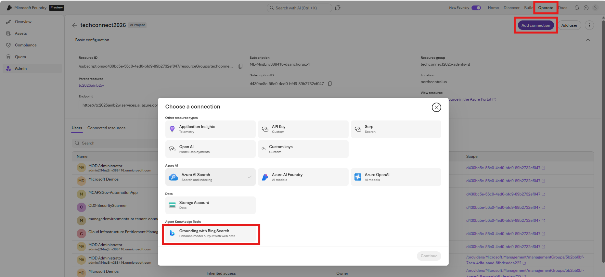
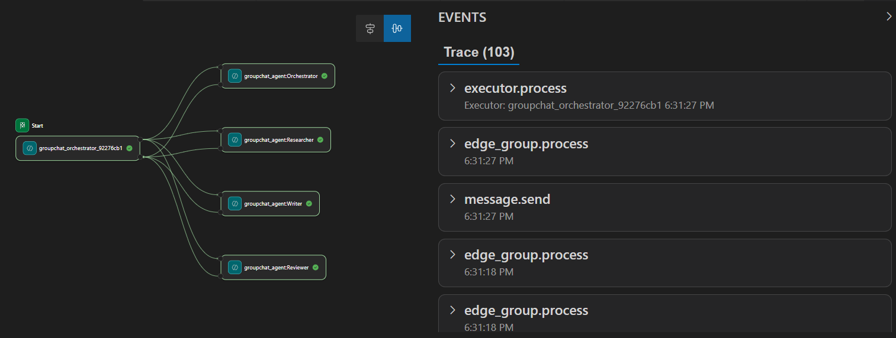

# From Zero to Hero: Building Agents with Microsoft Foundry and Agent Framework

## Create agents in Foundry

### Requirements

#### Login to Azure

```bash
az login
```

#### Environment setup

```bash
export RG=<your-resource-group>
export LOCATION=<your-location> # one that supports hosted agents, e.g., northcentralus
```

#### Install resources

```bash
az group create --name $RG --location $LOCATION
# deployment with file parameters
az deployment group create --resource-group $RG --template-file infra/basic-setup.bicep --parameters @infra/basic-setup.parameters.json
```

Update env variables with outputs from deployment

```bash
export FOUNDRY_RESOURCE_NAME=<your-foundry-resource-name>
export FOUNDRY_PROJECT_NAME=<your-foundry-project-name>
export AZURE_AI_PROJECT_ENDPOINT="https://$FOUNDRY_RESOURCE_NAME.services.ai.azure.com/api/projects/$FOUNDRY_PROJECT_NAME"
export AZURE_AI_MODEL_DEPLOYMENT_NAME="gpt-4.1"  # or your deployment name
```

From portal:

- Create a `Grounding with bing` resource and connect to the Microsoft Foundry project (https://learn.microsoft.com/en-us/azure/ai-foundry/agents/how-to/tools/bing-tools?view=foundry&tabs=grounding-with-bing&pivots=python#prerequisites)




### Install the Agent Framework package

```bash
python3 -m venv venv
source venv/bin/activate
pip install -r requirements.txt
pip list
```

### Create an agent

```bash
python agents-standalone/create_research_agent.py
python agents-standalone/create_writer_agent.py
python agents-standalone/create_reviewer_agent.py
```

### Publish the agent

Use publish in Foundry portal. 

You get a set of endpoints for the Researcher agent (responses api and activity protocol):

### Test the agent

Use the responses endpoint to test the agent:

```bash
export AGENT_NAME=ResearcherAgent
python agents-client/agent_client.py "What are the latest AI trends?"
```

## Create workflow

Test the sequential agents workflow

```bash
python orchestration/sequential_agents.py
```

## Deploy as hosted agent

First, install required packages

```bash
pip install azure-ai-agentserver-agentframework
```

Run locally:

```bash
python orchestration/hosted/sequential_agents_as_agent.py
```

Test it using the Local Agent Playground from the Microsoft Foundry extension. Notice no traces yet.


Alternative, test it:

```bash
curl -X POST http://localhost:8088/responses \
  -H "Content-Type: application/json" \
  -d '{
    "input": "Report about the latest AI trends."
}'
```

Use the Microsoft Foundry extension to deploy a hosted agent. 

### Give permission to the Foundry Managed Identity

Use the portal to give "Azure AI User" role to the Foundry Project Managed Identity.

### Publish and test

Publish the hosted agents in Foundry portal.

Test the Group Chat hosted agent:

```bash
export AGENT_NAME=researchgrchatwf
python agents-client/agent_client.py "Write a short article about the latest AI trends."
```

## Observability

### Configure Application Insights

Setup an Application Insights resource connected to the Foundry project.

Make it in the Foundry portal: Operate/Admin/<choose project>/Connected Resources/Application Insights

Run some tests:

```bash
export AGENT_NAME=researchgrchatwf
python agents-client/agent_client.py "What are the latest AI trends?"
```

REVIEW THIS: 

See that data is flowing into Application Insights without any code changes. 
See Traces & Monitor in Foundry portal.
See Application Insights in Azure portal/Agents. (Note: I only see traces in "search". Tables are empty, only  dependency table has some data).

### Add observability using AI Toolkit

Use Ai Toolkit to generate tracing configuration over a copy of the orchestration/hosted/group_chat_agent_manager_as_agent.py file (see result in orchestration/tracing/group_chat_agent_manager_as_agent.py).

IMPORTANT: start the Local Agent Playground in the Microsoft Foundry extension first.

Then change port 4319 and execute:

```bash
python orchestration/tracing/group_chat_agent_manager_as_agent.py
```

Test it using the Local Agent Playground from the Microsoft Foundry extension:



### Deploy new version of the traced hosted agent

Use the Microsoft Foundry extension to deploy the traced version of the group chat hosted agent (orchestration/tracing/group_chat_agent_manager_as_agent.py).

Then, pubslish and test again:

```bash
export AGENT_NAME=researchgrchatwf
python agents-client/agent_client.py "Write a short article about the latest AI trends."
```


