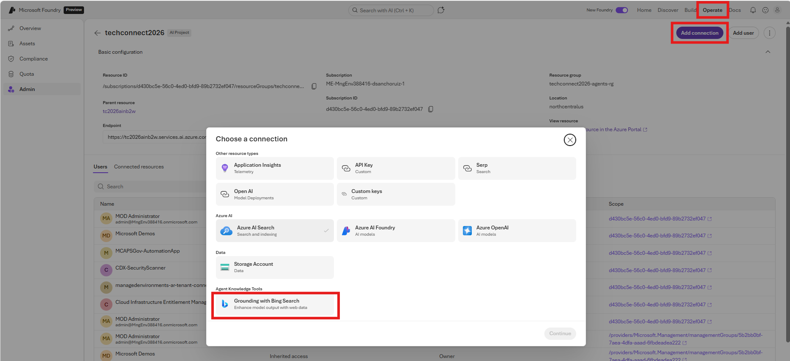
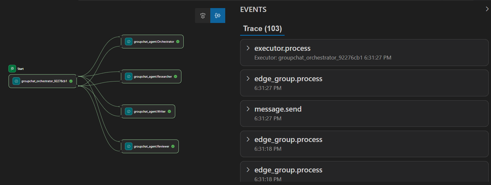

# From Zero to Hero: Building Agents with Microsoft Foundry and Agent Framework

## Create agents in Foundry

### Requirements

#### Login to Azure

```bash
az login
```

#### Environment setup

```bash
export RG=<your-resource-group>
export LOCATION=<your-location>
export AGENTS_HOME=from-zero-to-hero
export PARAMETERS_FILE=basic-setup.parameters.json
```

Move to `AGENTS_HOME`:
```bash
cd $AGENTS_HOME
```

#### Install resources

Before deploying the infra resources, check the file `infra/basic-setup.parameters.json` to set the location and resource names you want.

```bash
az group create --name $RG --location $LOCATION
# deployment with file parameters
az deployment group create --resource-group $RG --template-file infra/basic-setup.bicep --parameters @infra/$PARAMETERS_FILE
```

Update env variables with outputs from deployment

```bash
# get vars from deployment output
export FOUNDRY_RESOURCE_NAME=$(az deployment group show --resource-group $RG --name basic-setup --query properties.outputs.accountName.value -o tsv)
export FOUNDRY_PROJECT_NAME=$(az deployment group show --resource-group $RG --name basic-setup --query properties.outputs.projectName.value -o tsv) 
export AZURE_AI_PROJECT_ENDPOINT="https://$FOUNDRY_RESOURCE_NAME.services.ai.azure.com/api/projects/$FOUNDRY_PROJECT_NAME"
export AZURE_AI_MODEL_DEPLOYMENT_NAME="gpt-4.1"  # or your deployment name
```

From portal:

- Create a `Grounding with bing` resource and connect to the Microsoft Foundry project (https://learn.microsoft.com/en-us/azure/ai-foundry/agents/how-to/tools/bing-tools?view=foundry&tabs=grounding-with-bing&pivots=python#prerequisites)



Export variable:

```bash
export BING_CONNECTION_NAME=<your-bing-connection-name> 
export SUBSCRIPTION_ID=$(az account show --query id -o tsv)
export BING_PROJECT_CONNECTION_ID="/subscriptions/$SUBSCRIPTION_ID/resourceGroups/$RG/providers/Microsoft.CognitiveServices/accounts/$FOUNDRY_RESOURCE_NAME/projects/$FOUNDRY_PROJECT_NAME/connections/$BING_CONNECTION_NAME"
```


### Create venv and install the Agent Framework packages

As of March 3rd, 2026, I will create two venvs:
- venvrc2 for latest MAF packages (rc2)
- venv260107 for previous MAF packages (260107) and compatible with azure-ai-agentserver-agentframework 1.0.0b15

```bash
python3 -m venv venvrc2
source venvrc2/bin/activate
pip install -r requirements-rc2.txt
pip list
deactivate
python3 -m venv venv260107
source venv260107/bin/activate
pip install -r requirements-260107.txt
pip list
deactivate
```

### Create agents

Activate latest venv:

```bash
source venvrc2/bin/activate
```

**Using Foundry SDK**

```bash
python agents-standalone/foundry/create_research_agent.py
python agents-standalone/foundry/create_writer_agent.py
python agents-standalone/foundry/create_reviewer_agent.py
```

**Using Microsoft Agent Framework**

```bash
python agents-standalone/maf/create_research_agent.py
python agents-standalone/maf/create_writer_agent.py
python agents-standalone/maf/create_reviewer_agent.py
```

### Publish the agent

Use publish in Foundry portal. 

You get a set of endpoints for the Researcher agent (responses api and activity protocol):

### Test the agent

Use the responses endpoint to test the agent:

```bash
export AGENT_NAME=ResearcherAgentV2
python agents-client/agent_client.py "What are the latest AI trends?"
```

## Create workflow

Test the sequential agents workflow

```bash
python orchestration/demo/sequential_agents.py
```

Test the group chat agent workflow

```bash
python orchestration/demo/group_chat_agent_manager.py
```

## Build as Agent and trace the workflow locally

As per today (March 3rd, 2026), we have to use the previous venv (260107) to build the orchestration as an agent.

Activate the previous venv:

```bash
deactivate
source venv260107/bin/activate
```

### Workflow as agent

First, we will adapt the workflow to become an agent. For that, we will use the `azure-ai-agentserver-agentframework` library to expose the workflow as agent. The relevant code is:

```python
      agentwf = workflow.as_agent()
      await from_agent_framework(agentwf).run_async()
```

### Instrument the agent


We will use the `AI Toolkit` extension to generate tracing configuration. Open the agent under `orchestration/tracing/group_chat_agent_manager_as_agent.py` and enable tracing using the helper from the extension (you can also apply it to the sequential_agents_as_agent.py if you want): 


The extension will use Github Copilot to generate the tracing configuration code:


### Run and test locally

We will now use the `Microsoft Foundry` extension to test the agent and explore traces. First, open the Microsoft Foundry extension and start the Local Agent Playground.


Then, run the traced agent locally:

```bash
python orchestration/tracing/solution/group_chat_agent_manager_as_agent.py
```

Test it using the Local Agent Playground from the Microsoft Foundry extension and see the agent run and traces:



Alternatively, you can test it using curl:

```bash
curl -X POST http://localhost:8088/responses \
  -H "Content-Type: application/json" \
  -d '{
    "input": "Report about the latest AI trends."
}'
```

## Observability with Azure Monitor

Once we have the workflow as agent tested locally and ready to be deploy as `hosted agent` we will enable tracing in **Microsoft Foundry**. We need to connect your Foundry project to an Application Insights resource. The Application Insights resource was already created during the infrastructure deployment, so you just need to link it:

1. Open the [Foundry portal](https://ai.azure.com)
2. Navigate to **Operate** → **Admin** → *your project* → **Connected Resources** → **Application Insights**
3. Connect the Application Insights resource created in the infrastructure step


## Deploy as hosted agent


NOTE: Two new repositories have been created for the hosted agent code. The following instructions are good for understanding how to deploy, but if you want to skip directly to the hosted agent code, you can find it under the following repositories:

- Group Chat Agent: https://github.com/dsanchor/groupchat-orchestration-writer.git
- Sequential Agents: https://github.com/dsanchor/sequential-orchestration-writer.git

### Understand folder structure

In order to deploy the workflow as a hosted agent in Foundry, we will need to create several files under the agent's folder:

- the agent code: `orchestration/hosted/groupchat/group_chat_agent_manager_as_agent.py`
- a python file with the OpenTelemetry configuration for Azure Monitor: `orchestration/hosted/groupchat/observability.py`. This file will be used to configure the OpenTelemetry providers to send traces to Azure Monitor. We need this file because the configuration for Azure Monitor is different than the one for local tracing with AI Toolkit, so we need to separate the configuration and import the correct one depending on where we are running (locally with AI Toolkit or as hosted agent in Foundry).
- a `requirements.txt` file with the dependencies
- a `Dockerfile` to build the container image
- a .env file with environment variables that are then injected into the container. For this demo, the required variables are:
    ```
    AZURE_AI_PROJECT_ENDPOINT=
    AZURE_AI_MODEL_DEPLOYMENT_NAME=
    ```

Also, we need to create a `.foundry/.deployment.json` file to define the hosted agent deployment options. The Microsoft Foundry extension will look for this file to know how to build and deploy the hosted agent. The content of the file would be generated for you if you use the extension to deploy, but there is a limitation that it doesn't generate the correct dockerContextPath if your Dockerfile is not in the root of the project, so make sure to update those paths to point to the `orchestration/hosted/groupchat` folder:

```json
{
  "hostedAgentDeployOptions": {
    "dockerContextPath": "/workspaces/agents-observability-tt202/from-zero-to-hero/orchestration/hosted/groupchat",
    "dockerfilePath": "/workspaces/agents-observability-tt202/from-zero-to-hero/orchestration/hosted/groupchat/Dockerfile",
    "agentName": "groupchatwriter",
    "cpu": "1.0",
    "memory": "2.0Gi"
  }
}
```

You can try without this file and you will be asked to fill in the deployment options in the Microsoft Foundry extension UI when you click on Deploy, but the final deployment will fail as the context is just the root of the project and not the folder where the Dockerfile is (that is defult behavior of the extension).

To avoid this, you can copy the content from `orchestration/hosted/groupchat/.foundry/.deployment.json` to the root `.foundry/.deployment.json` before deploying, or just update the paths in the existing root `.foundry/.deployment.json` to point to the correct Dockerfile and context.

### Deploy

In the Local Agent Playground from the Microsoft Foundry extension, click on `Deploy` and select the folder `orchestration/hosted/groupchat`. This will build the container image and deploy it as a hosted agent in Foundry:


It takes a few minutes to build and deploy the agent. Once it's deployed, you can see it in the Foundry portal under Agents.

**Important:** Before testing, we need to give permission to the Foundry Project Managed Identity. Use the portal to give "Azure AI User" role over the Foundry project.

You can now test the hosted agent from the portal or even better, from the Hosted Agent Playground in the Microsoft Foundry extension, select the `groupchatwriter` or `sequentialwriter` agent and version to finally test it with a prompt:


Optionally, you can also test it using the responses endpoint as before, just changing the AGENT_NAME to the name of the hosted agent. Remember that you must publish the hosted agent in Foundry portal first.


```bash
export AGENT_NAME=groupchatwriter
python agents-client/agent_client.py "Write a short article about the latest AI trends."
```

### Explore traces in Microsoft Foundry

Under the `Traces` tab, click on the `Trace ID` and you would see a similar output to this:


You can also explore the metrics directly from Application Insights:


