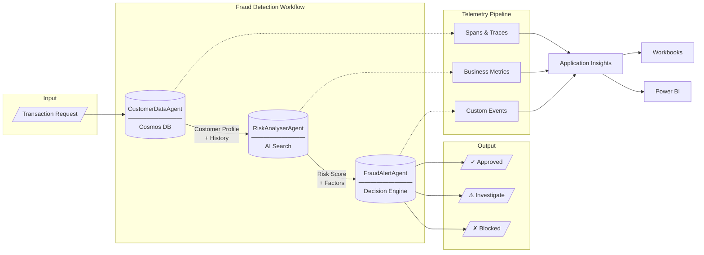
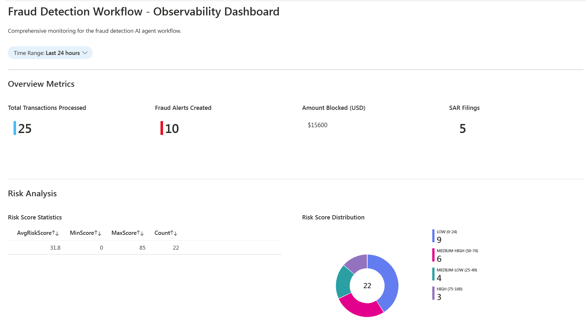
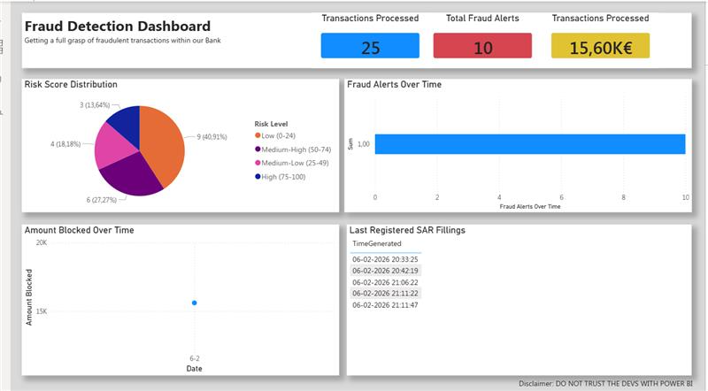

# Production Ready Observability - Fraud Detection Agents

This project demonstrates production-grade observability patterns for AI agent systems through a real-world fraud detection scenario. It features three specialized AI agents orchestrated in a sequential workflow:



- **CustomerDataAgent** — Retrieves customer profiles and transaction history from Cosmos DB
- **RiskAnalyserAgent** — Evaluates fraud risk using AI Search-indexed regulations and policies  
- **FraudAlertAgent** — Creates alerts and compliance filings (SAR reports)

**Workshop Structure:**
- **Part 1 - Infrastructure Deployment**: Deploy Azure resources (AI Services, Cosmos DB, AI Search, App Insights) and seed sample data
- **Part 2 - Create the Tracing Engine**: Run individual agents, orchestrate workflows, and generate telemetry with OpenTelemetry
- **Part 3 - Visualize Traces and Logs**: Import Application Insights workbooks, explore with Grafana, and build Power BI dashboards for business stakeholders

**Key Capabilities:**
- **End-to-end distributed tracing** with hierarchical spans for each agent operation
- **Business metrics** tracking risk scores, blocked amounts, SAR filings, and customer friction
- **Azure integration** with Application Insights, Cosmos DB, and AI Search
- **Pre-built dashboards** via Application Insights workbooks and Power BI templates
- **Business transparency** through executive dashboards that propagate observability to decision makers

The observability implementation showcases best practices for spans, attributes, events, and metrics—providing a reference architecture for monitoring AI agent systems in production.

## Part 1 - Infrastructure Deployment

**Prerequisites**
- Azure CLI installed and logged in (`az login`)
- Subscription with permissions to create resources

> [!NOTE]
> Infrastructure in `Part 1 - From zero to hero` is different than the one in this part.

### 1.1 Deploy Resources

```bash
export RG=<your-resource-group>
export LOCATION=northcentralus

# Create resource group
az group create --name $RG --location $LOCATION

# Deploy all resources (AI Services, Cosmos DB, AI Search, App Insights)
az deployment group create \
  --resource-group $RG \
  --template-file production-ready-observability/infra/setup.bicep \
  --parameters @production-ready-observability/infra/setup.parameters.json
```

### 1.2 Configure Environment

Run the setup script to populate the `.env` file with all deployed resource keys:

```bash
./infra/setup-env.sh $RG
```

### 1.3 Seed Data

Populate Cosmos DB and Azure AI Search with sample data:

```bash
./data/seed_data.sh
```

This will:
- Create the `FinancialComplianceDB` database in Cosmos DB
- Create containers for `Customers` and `Transactions` data
- Import sample customer and transaction records
- Set up the `regulations-policies` index in Azure AI Search
- Upload regulatory documents for the risk analysis agent

## Part 2 - Create the Tracing Engine


### 2.1 - Run Individual Agents 

```bash
python agents/customer_data_agent.py
python agents/risk_analyser_agent.py
python agents/fraud_alert_agent.py
```

Go to your new [Foundry Portal](www.ai.azure.com/nextgen) and find a first version of your 3 agents there.

### 2.2 Run Workflow of the 3 Agents 

```bash
python workflows/workflow.py
```

This workflow orchestrates the three agents registered in the Foundry Portal in a sequential pipeline:

1. **CustomerDataAgent** retrieves customer profile and transaction history from Cosmos DB
2. **RiskAnalyserAgent** evaluates fraud risk using AI Search-indexed regulations and policies
3. **FraudAlertAgent** makes the final decision—approving, investigating, or blocking the transaction

The workflow produces comprehensive telemetry including distributed traces, business events, and metrics that flow to Application Insights for monitoring and analysis.

For detailed documentation on how distributed tracing is implemented in this workflow, including span creation, business events, metrics, and the complete trace hierarchy, check: **[Tracing Documentation](TRACING.md)**

This guide covers:
- Telemetry initialization and the `TelemetryManager` singleton
- Creating and configuring spans for agent operations
- Understanding `set_attribute` vs `add_event`
- Business event naming conventions
- Complete trace hierarchy visualization
- All available business metrics and how to query them

### 2.3  Batch Run for Telemetry Generation

Run a batch of 10 transactions to generate telemetry data for Application Insights dashboards and workbooks.

### Run Batch
```bash
cd batch_run
python batch_runner.py
```

### Output

The batch runner processes 10 transactions and generates:
- **Telemetry traces** for each transaction workflow
- **Business metrics** (risk scores, alerts, amounts blocked)
- **Batch summary events** (`fraud_detection.batch.started`, `fraud_detection.batch.completed`)
- **Console summary** with statistics


## Part 3 - Where to for Traces and Logs of Foundry Agents 

### 3.1 - Import Application Insights Workbook

A pre-built workbook is available for visualizing all fraud detection metrics:

1. Open your Application Insights resource in the Azure Portal
2. Navigate to **Workbooks** in the left menu
3. Click **+ New**
4. Click the **Advanced Editor** button (`</>` icon)
5. Copy the contents of `workbook/fraud-detection-workbook.json`
6. Paste into the editor and click **Apply**
7. Click **Done Editing** to save

Your workbook, now reflecting the metrics we have created and populated with our OTEL method, will look something similar to this:



The workbook includes:
- **Overview Metrics**: Transactions processed, alerts created, amount blocked, SAR filings
- **Risk Analysis**: Risk score distribution and trends
- **Model Performance**: Confidence scores and top risk factors
- **Fraud Prevention**: Alerts by severity, blocked amounts over time
- **Customer Experience**: Friction events and false positives
- **Compliance**: SAR filing details and timeline
- **Agent Performance**: Processing times and success rates
- **Transaction Explorer**: Search and filter recent transactions
- **Errors & Exceptions**: Error monitoring and troubleshooting

### 3.2 Explore your Traces with Grafana

### 3.3 Explore the Transaction Search 

### 3.4 Send the data to your BDMs - Power BI Dashboard

#### Why Business Dashboards Matter

While Application Insights workbooks are excellent for technical teams, **Business Decision Makers (BDMs)** need access to the same observability data in tools they already use—like Power BI. This ensures that:

- **Transparency flows to leadership**: Executives can see real-time fraud detection performance without accessing Azure portals
- **Data-driven decisions**: Business metrics (amount blocked, SAR filings, alert rates) drive strategic decisions
- **Compliance visibility**: Auditors and compliance officers can verify regulatory adherence through familiar reporting tools
- **Cross-functional alignment**: Technical and business teams share a single source of truth

The observability data we've collected with OpenTelemetry isn't just for debugging—it's a business asset that demonstrates the AI system's value and trustworthiness.

#### Connect Power BI to Log Analytics

##### 3.4.1 - Get Your Log Analytics Workspace Details

1. Go to **Azure Portal** → **Log Analytics workspaces**
2. Select your workspace (e.g., `law-frauddet5db5`)
3. Note the **Workspace ID** from the Properties blade

##### 3.4.2 Connect Power BI Desktop

1. Open **Power BI Desktop**
2. Click **Get Data** → Search for **"Azure Data Explorer (Kusto)"**
3. Enter the cluster URL:
   ```
   https://ade.loganalytics.io/subscriptions/<subscription-id>/resourcegroups/<resource-group>/providers/microsoft.operationalinsights/workspaces/<workspace-name>
   ```
4. Leave the database field empty
5. Authenticate with your Azure AD credentials

##### 3.4.3 Import the Data Tables

Select these tables from your workspace:
- **AppMetrics** - Contains all business metrics (transactions, alerts, amount blocked, risk scores)
- **AppTraces** - Contains detailed event logs (SAR filings, model predictions)

> **Note**: For workspace-based Application Insights, use `AppMetrics` and `AppTraces` (not `customMetrics` and `traces`).

##### 3.4.4 Create a Date Column for Time Series

Since DirectQuery mode has limitations, add a custom column in Power Query:

1. **Transform data** → Select your table
2. **Add Column** → **Custom Column**
3. Name: `Date`, Formula: `DateTime.Date([TimeGenerated])`
4. **Close & Apply**

##### 3.4.5 Build Your Executive Dashboard

Create these key visuals for business stakeholders:

| Visual | Type | Data | Business Value |
|--------|------|------|----------------|
| Transactions Processed | Card | Sum where Name = `fraud_detection.transactions.processed` | Volume indicator |
| Fraud Alerts | Card | Sum where Name = `fraud_detection.alerts.created` | Risk exposure |
| Amount Blocked | Card | Sum where Name = `fraud_detection.amount_blocked` | Money protected |
| SAR Filings | Card | Sum where Name = `fraud_detection.compliance.sar_filed` | Compliance status |
| Alerts Over Time | Bar Chart | Date × Sum (filtered by alerts) | Trend analysis |
| Risk Score Trend | Line Chart | Date × Average Sum (filtered by risk score) | Model performance |

For this workshop, we have left you with a sample dashboard under the folder `powerbi/`. If you want to use it, go ahead. All you need to do is change the Data Source.

Your dashboard should look something like this:



##### Step 3.4.6 - Schedule Refresh

1. Publish to **Power BI Service**
2. Configure **Scheduled Refresh** (hourly or daily)
3. Share dashboard with BDM stakeholders

---

## Part 4 - Deploy to Production with Tracing

When you deploy these agents to production (e.g., Azure Container Apps, Kubernetes, or Azure Functions), the tracing continues to work seamlessly. Here's why:

### How Tracing Works in Containers

The observability code we wrote is **environment-agnostic**. The `TelemetryManager` reads the Application Insights connection string from an environment variable:

```python
app_insights_connection_string = os.environ.get("APPLICATIONINSIGHTS_CONNECTION_STRING")

if app_insights_connection_string:
    configure_azure_monitor(
        connection_string=app_insights_connection_string,
        enable_live_metrics=True,
    )
```

This means:
- **Locally**: The connection string comes from your `.env` file
- **In Containers**: The connection string is injected as an environment variable at runtime
- **Same code, same traces**: No code changes needed between environments

### What You Need to Do

1. **Pass the environment variable** when deploying your container:
   ```
   APPLICATIONINSIGHTS_CONNECTION_STRING=InstrumentationKey=xxx;IngestionEndpoint=https://...
   ```

2. **That's it.** The `azure-monitor-opentelemetry` package automatically detects the connection string and sends traces to the same Application Insights instance.

### The Result

Whether running locally or in production:
- All spans, events, and metrics flow to Application Insights
- The same workbooks and Power BI dashboards display production data
- Business stakeholders see real-time fraud detection performance
- Distributed traces link across all agent invocations

This is the power of OpenTelemetry—**instrument once, observe everywhere**.

---

## Summary

This workshop demonstrated how to build production-grade observability for AI agent systems:

| Part | Focus | Outcome |
|------|-------|---------|
| **Part 1** | Infrastructure | Azure resources deployed and configured |
| **Part 2** | Tracing Engine | OpenTelemetry instrumentation with business metrics |
| **Part 3** | Visualization | Workbooks, Grafana, and Power BI dashboards |
| **Part 4** | Production | Same tracing works in containers via environment variables |

The observability patterns demonstrated here—distributed tracing, business metrics, and executive dashboards—ensure that AI systems remain transparent, auditable, and trustworthy from development through production.


